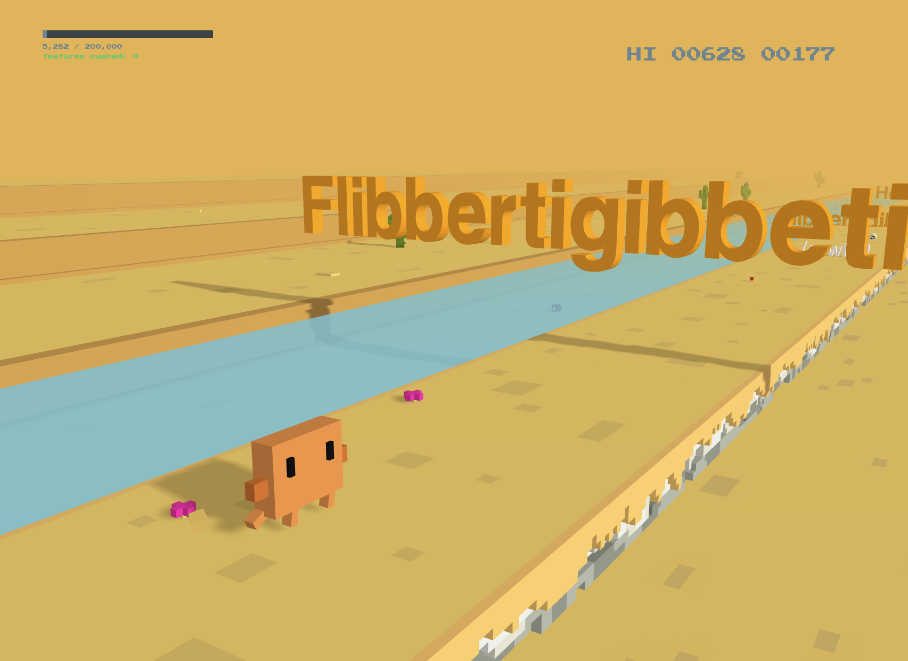

# Clawdino 3D

A Claude Code-themed mod of the awesome [T-Rex Run 3D](https://github.com/Priler/dino3d) by Abraham Tugalov.

**Play it here:** https://maxfoutech.github.io/clawdino/

## Screenshot

## About

Clawdino 3D is a 3D runner game where you play as Clawdino — a crab-like creature inspired by Claude Code. Instead of cacti and pterodactyls, obstacles are Claude Code commands, status messages, and error states.

The goal: **ship features as fast as you can.** Hit `git push` obstacles to push features, manage your context window, and keep your velocity up before time runs out.

## Gameplay

- **Jump:** Space / Arrow Up / Swipe Up (mobile)
- **Duck:** Arrow Down / Swipe Down (mobile)
- **Context window:** Fills up over time and when you hit obstacles. At 200k tokens, `/compact` spawns.
- **Speed friction:** Velocity naturally decays — hit obstacles to maintain momentum.
- **git push** (green text): Appears at 70%+ context. Hit it to push a feature and reset context.
- **Game over:** `5-hour limit reached`, `overloaded_error` (flying ptero)

### Obstacle Reference

| Obstacle | Color | Effect |
|----------|-------|--------|
| Mustering/Reticulating/Honking/Vibing… | Orange | +9k context, +vel |
| Flibbertigibbeting… | Orange | +18k context, +vel |
| You're / absolutely / right | White | +60k context, +vel |
| ultrathink | Rainbow | +150k context, +vel |
| /fast | White | Big speed boost |
| /clear | White | Reset context to 5k |
| /rewind | White | -20k context |
| /mcp | White | +24k context, +vel |
| /init | White | +45k context, +vel |
| git commit | White | Reset context (spawns at 50%+) |
| git push | Green | Reset context, +1 feature (spawns at 70%+) |
| Yes, clear context | White | Reset context (spawns at 80%+) |
| /compact | White (large) | Speed boost (spawns at 200k) |
| 5-hour limit reached | Red | **Game over** |
| overloaded_error (ptero) | Red | **Game over** (flying, spawns at score 400+) |

## Built With

- [Three.js](https://threejs.org/) — WebGL 3D renderer
- [Howler.js](https://github.com/goldfire/howler.js/) — Audio
- [three-nebula](https://github.com/creativelifeform/three-nebula) — Particle system
- [visibly.js](https://github.com/nickautomatic/visibly.js) — Page Visibility API

## Credits

This project is a fork of [T-Rex Run 3D](https://github.com/Priler/dino3d) by [Abraham Tugalov](http://howdyho.net) (C) 2020.

Original contributors:
- Aidar Ayupov & Vildan Safin — 3D model inspiration
- Rifat Fazlutdinov — Telegram bugreport bot
- Arnur Bekbolov — Skins ideas

Clawdino mod built with [Claude Code](https://claude.ai/code).
